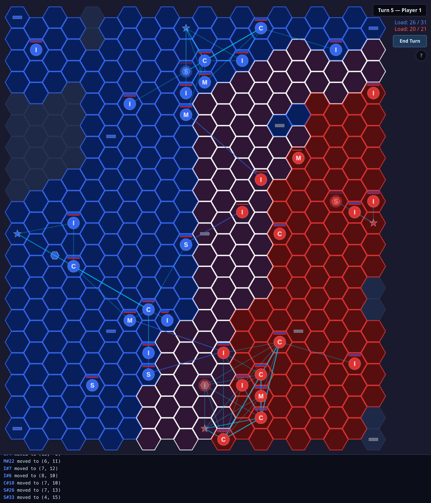

# Area Tactics

A turn-based hex strategy game playable in the browser, with an AI opponent.



## About

Two players compete on a hex grid, claiming territory, capturing depots and facilities, and building units to overwhelm the opponent. See [MANUAL.md](MANUAL.md) for full rules and gameplay details.

## Getting started

```bash
npm install
npm run dev      # start dev server at http://localhost:5173
```

## Build

```bash
npm run build    # output to dist/
```

## Other commands

| Command | Description |
|---|---|
| `npm test` | Run unit tests |
| `npm run lint` | Lint with ESLint |
| `npm run format` | Format source with Prettier |
